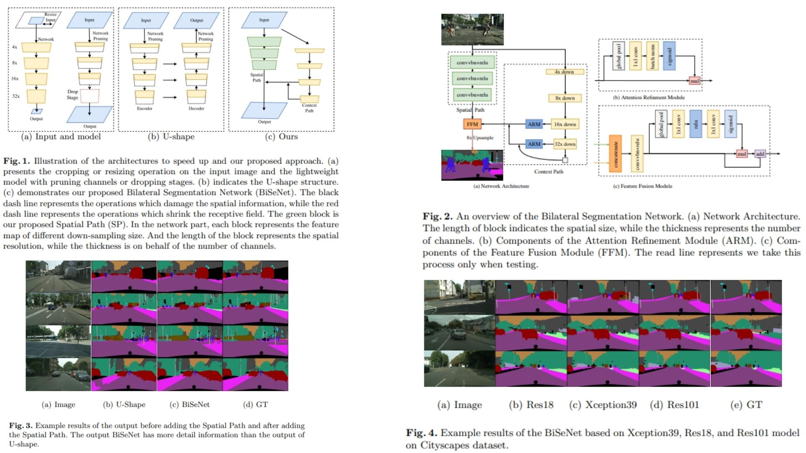

# 👥 BiSeNet-Replication — Bilateral Segmentation Network for Real-Time Semantic Segmentation

This repository provides a **faithful Python replication** of the **BiSeNet framework** for real-time semantic segmentation.  
It implements the pipeline described in the original paper, including a **dual-path architecture (Spatial Path + Context Path), attention refinement, and feature fusion strategy**.

Paper reference: *BiSeNet: Bilateral Segmentation Network for Real-time Semantic Segmentation*  https://arxiv.org/abs/1808.00897  

---

## Overview 🪷



> The architecture decomposes semantic segmentation into two complementary streams: a **Spatial Path for preserving fine-grained details** and a **Context Path for capturing large receptive field semantics**, followed by attention-guided feature fusion.

Key points:

* **Spatial Path** extracts high-resolution features using a lightweight stride-2 convolution stack, producing a $$\frac{1}{8}$$ resolution feature map  
* **Context Path** leverages a lightweight backbone (e.g., Xception/ResNet-style) and global pooling to obtain large receptive field representations  
* **Attention Refinement Module (ARM)** refines contextual features via global average pooling-based channel attention  
* **Feature Fusion Module (FFM)** merges spatial and contextual features using attention-guided reweighting  

---

## Core Math 📐

**Spatial Path downsampling**:

$$
F_{sp} = f_3(f_2(f_1(x))), \quad \text{stride}(f_i)=2
$$

**Context feature extraction**:

$$
F_{cp} = \text{Backbone}(x)
$$

**Global context aggregation (ARM)**:

$$
\alpha = \sigma(\text{Conv}(\text{GAP}(F_{cp})))
$$

$$
F'_{cp} = F_{cp} \cdot \alpha
$$

**Feature Fusion Module (FFM)**:

$$
F = \text{Concat}(F_{sp}, F_{cp})
$$

$$
w = \sigma(\text{GAP}(F))
$$

$$
F_{out} = F + F \cdot w
$$

**Final prediction**:

$$
Y = \text{Conv}_{1 \times 1}(F_{out})
$$

---

## Why BiSeNet Matters 🧿

* Decouples **spatial detail preservation** and **semantic context modeling** into two independent streams  
* Avoids heavy decoder structures like full U-Net while maintaining boundary quality  
* Efficiently integrates global context using lightweight attention mechanisms  

---

## Repository Structure 🏗️

```bash
BiSeNet-Replication/
├── src/
│   ├── blocks/
│   │   ├── conv.py               
│   │   ├── arm.py               
│   │   ├── ffm.py                
│   │   └── utils.py             
│   │
│   ├── modules/
│   │   ├── spatial_path.py       
│   │   └── context_path.py      
│   │
│   ├── model/
│   │   └── bisenet.py           
│   │
│   ├── loss/
│   │   └── loss.py                
│   │
│   └── config.py                
│
├── images/
│   └── figmix.jpg                
│
├── requirements.txt
└── README.md
```

---

## 🔗 Feedback

For questions or feedback, contact:  
[barkin.adiguzel@gmail.com](mailto:barkin.adiguzel@gmail.com)
